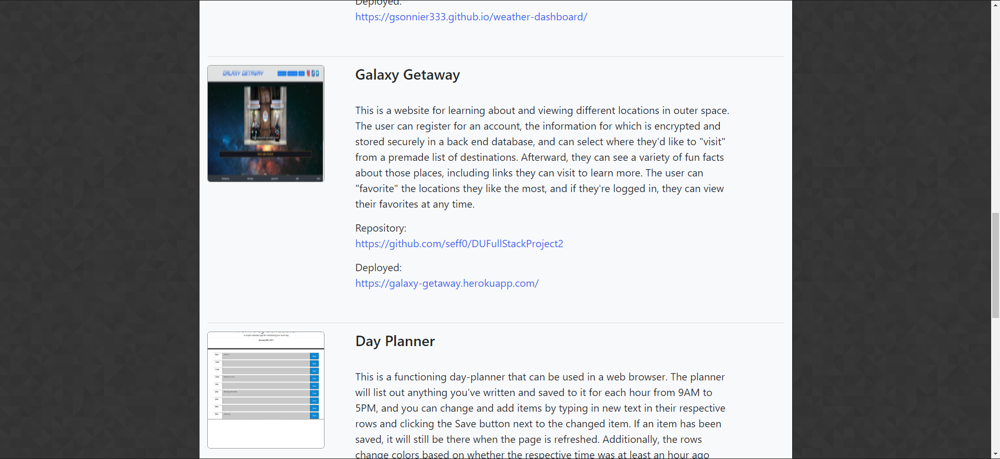
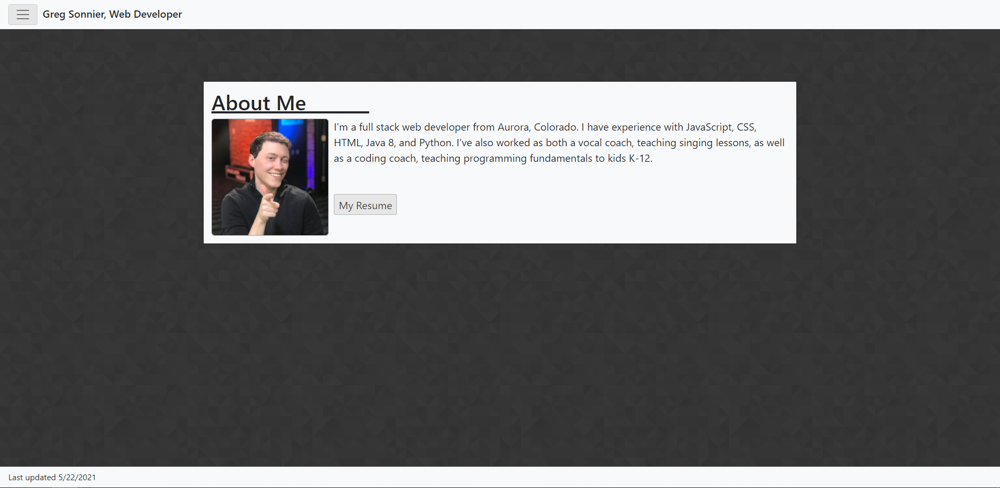
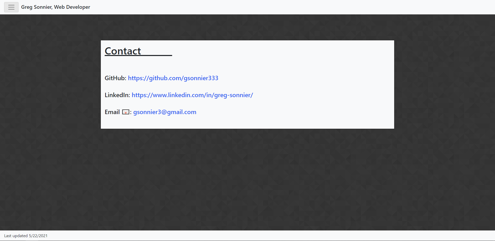

# React Portfolio

This is my web development portfolio, built in React. It's meant to show off some of the web apps and pages I've built on my journey to become a web developer. The main page is the portfolio with a list of some of my projects (which can be viewed via the links on the page), while there's also an About Me and a Contact page that can be navigated to by clicking the dropdown menu in the top left corner of the page. My resume can be downloaded as a PDF from the About Me page, and my email, LinkedIn, and Github links can all be found on the Contact page.

## Screenshots

